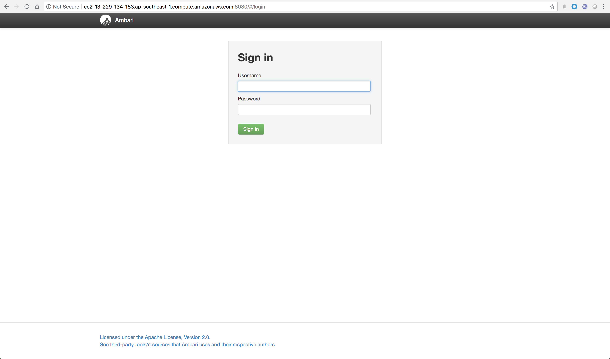
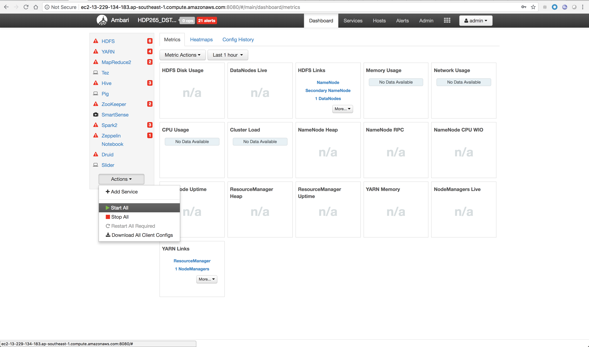

# HDP Labs

Content

* [Lab 1 - Accessing the sandbox](#accessing-the-sandbox)
* [Lab 2 - Load the sample datasets to HDFS](#load-the-sample-datasets-to-hdfs)
* Create Hive tables
* Analyze the datasets

## Accessing the sandbox

Open a web browser and go to the following url

```http://<provided_url>:8080/```

Username: admin
Password: admin



Once logged in, start all services



## Load the sample datasets to HDFS

Download [GeoIPCountryCSV.zip](https://github.com/charlesb/HDP-workshop/raw/master/samples/GeoIPCountryCSV.zip) and [WebLogs.zip](https://github.com/charlesb/HDP-workshop/raw/master/samples/WebLogs.zip) from the samples folder

Follow this [link](https://dev.maxmind.com/geoip/legacy/csv/#Integer_IPv4_Representation) for a description

Different formats can also be [downloaded](http://geolite.maxmind.com/download/geoip/database/GeoIPCountryCSV.zip)


Then go to Files View

Create a new folder workshop under /user/admin/

Unzip GeoIPCountryCSV.zip and upload file

Create a table in Hive

Go to Hive View 2.0

CREATE TABLE geo_ip_country_whois (
start_ip_address STRING,
end_ip_address STRING,
start_ip_int INT,
end_ip_int INT,
country_code VARCHAR(2),
country_name VARCHAR(50)
)
ROW FORMAT SERDE 'org.apache.hadoop.hive.serde2.OpenCSVSerde'
WITH SERDEPROPERTIES (
   "separatorChar" = ",",
   "quoteChar"     = "\""
);

LOAD DATA INPATH '/user/admin/workshop/GeoIPCountryWhois.csv' OVERWRITE INTO TABLE geo_ip_country_whois;

SELECT * FROM geo_ip_country_whois;

https://gist.github.com/rm-hull/bd60aed44024e9986e3c

Unzip WbLogs.zip and upload access.log into previous folder

Go to Hive View 2.0

CREATE TABLE raw_logs (
log STRING
);

LOAD DATA INPATH '/user/admin/workshop/access.log' OVERWRITE INTO TABLE raw_logs;

SELECT * FROM raw_logs LIMIT 10;

https://httpd.apache.org/docs/1.3/logs.html#combined

(\S+) (\S+) (\S+) \[([^\]]+)\] "([A-Z]+) ([^ "]+)? HTTP\/[0-9.]+" ([0-9]{3}) ([0-9]+|-) "([^"]*)" "([^"]*)" "(\S+)"

SELECT
  regexp_extract(log, "([^ ]*) ([^ ]*) ([^ ]*) (-|\\[[^\\]]*\\]) ([^ \"]*|\"[^\"]*\") (-|[0-9]*) (-|[0-9]*)(?: ([^ \"]*|\"[^\"]*\") ([^ \"]*|\"[^\"]*\"))?", 1) ip,
  cast(regexp_extract(regexp_extract(log, "([^ ]*) ([^ ]*) ([^ ]*) (-|\\[[^\\]]*\\]) ([^ \"]*|\"[^\"]*\") (-|[0-9]*) (-|[0-9]*)(?: ([^ \"]*|\"[^\"]*\") ([^ \"]*|\"[^\"]*\"))?", 1),"(\\d+)\\.(\\d+)\\.(\\d+)\\.(\\d+)",1) as bigint) * 16777216 +
  cast(regexp_extract(regexp_extract(log, "([^ ]*) ([^ ]*) ([^ ]*) (-|\\[[^\\]]*\\]) ([^ \"]*|\"[^\"]*\") (-|[0-9]*) (-|[0-9]*)(?: ([^ \"]*|\"[^\"]*\") ([^ \"]*|\"[^\"]*\"))?", 1),"(\\d+)\\.(\\d+)\\.(\\d+)\\.(\\d+)",2) as bigint) * 65536 +
  cast(regexp_extract(regexp_extract(log, "([^ ]*) ([^ ]*) ([^ ]*) (-|\\[[^\\]]*\\]) ([^ \"]*|\"[^\"]*\") (-|[0-9]*) (-|[0-9]*)(?: ([^ \"]*|\"[^\"]*\") ([^ \"]*|\"[^\"]*\"))?", 1),"(\\d+)\\.(\\d+)\\.(\\d+)\\.(\\d+)",3) as bigint) * 256 +
  cast(regexp_extract(regexp_extract(log, "([^ ]*) ([^ ]*) ([^ ]*) (-|\\[[^\\]]*\\]) ([^ \"]*|\"[^\"]*\") (-|[0-9]*) (-|[0-9]*)(?: ([^ \"]*|\"[^\"]*\") ([^ \"]*|\"[^\"]*\"))?", 1),"(\\d+)\\.(\\d+)\\.(\\d+)\\.(\\d+)",4) as bigint) as ip_to_int,
  regexp_extract(log, "([^ ]*) ([^ ]*) ([^ ]*) (-|\\[[^\\]]*\\]) ([^ \"]*|\"[^\"]*\") (-|[0-9]*) (-|[0-9]*)(?: ([^ \"]*|\"[^\"]*\") ([^ \"]*|\"[^\"]*\"))?", 4) time,
  regexp_extract(log, "([^ ]*) ([^ ]*) ([^ ]*) (-|\\[[^\\]]*\\]) ([^ \"]*|\"[^\"]*\") (-|[0-9]*) (-|[0-9]*)(?: ([^ \"]*|\"[^\"]*\") ([^ \"]*|\"[^\"]*\"))?", 5) request
FROM raw_logs
limit 1;

CREATE TABLE web_logs (
ip VARCHAR(15),
ip_to_int INT,
time STRING,
request STRING
)
STORED AS ORC
TBLPROPERTIES ("orc.compress"="SNAPPY");

INSERT OVERWRITE TABLE web_logs
SELECT
  regexp_extract(log, "([^ ]*) ([^ ]*) ([^ ]*) (-|\\[[^\\]]*\\]) ([^ \"]*|\"[^\"]*\") (-|[0-9]*) (-|[0-9]*)(?: ([^ \"]*|\"[^\"]*\") ([^ \"]*|\"[^\"]*\"))?", 1) ip,
  cast(regexp_extract(regexp_extract(log, "([^ ]*) ([^ ]*) ([^ ]*) (-|\\[[^\\]]*\\]) ([^ \"]*|\"[^\"]*\") (-|[0-9]*) (-|[0-9]*)(?: ([^ \"]*|\"[^\"]*\") ([^ \"]*|\"[^\"]*\"))?", 1),"(\\d+)\\.(\\d+)\\.(\\d+)\\.(\\d+)",1) as bigint) * 16777216 +
  cast(regexp_extract(regexp_extract(log, "([^ ]*) ([^ ]*) ([^ ]*) (-|\\[[^\\]]*\\]) ([^ \"]*|\"[^\"]*\") (-|[0-9]*) (-|[0-9]*)(?: ([^ \"]*|\"[^\"]*\") ([^ \"]*|\"[^\"]*\"))?", 1),"(\\d+)\\.(\\d+)\\.(\\d+)\\.(\\d+)",2) as bigint) * 65536 +
  cast(regexp_extract(regexp_extract(log, "([^ ]*) ([^ ]*) ([^ ]*) (-|\\[[^\\]]*\\]) ([^ \"]*|\"[^\"]*\") (-|[0-9]*) (-|[0-9]*)(?: ([^ \"]*|\"[^\"]*\") ([^ \"]*|\"[^\"]*\"))?", 1),"(\\d+)\\.(\\d+)\\.(\\d+)\\.(\\d+)",3) as bigint) * 256 +
  cast(regexp_extract(regexp_extract(log, "([^ ]*) ([^ ]*) ([^ ]*) (-|\\[[^\\]]*\\]) ([^ \"]*|\"[^\"]*\") (-|[0-9]*) (-|[0-9]*)(?: ([^ \"]*|\"[^\"]*\") ([^ \"]*|\"[^\"]*\"))?", 1),"(\\d+)\\.(\\d+)\\.(\\d+)\\.(\\d+)",4) as bigint) as ip_to_int,
  regexp_extract(log, "([^ ]*) ([^ ]*) ([^ ]*) (-|\\[[^\\]]*\\]) ([^ \"]*|\"[^\"]*\") (-|[0-9]*) (-|[0-9]*)(?: ([^ \"]*|\"[^\"]*\") ([^ \"]*|\"[^\"]*\"))?", 4) time,
  regexp_extract(log, "([^ ]*) ([^ ]*) ([^ ]*) (-|\\[[^\\]]*\\]) ([^ \"]*|\"[^\"]*\") (-|[0-9]*) (-|[0-9]*)(?: ([^ \"]*|\"[^\"]*\") ([^ \"]*|\"[^\"]*\"))?", 5) request
FROM raw_logs


SELECT count(*) FROM web_logs;

https://dev.maxmind.com/geoip/legacy/csv/#Integer_IPv4_Representation


select ip, country_name
from (
select
regexp_extract(log, '^(?:([^ ]*),?){1}', 1) ip,
cast(regexp_extract(regexp_extract(log, '^(?:([^ ]*),?){1}', 1),"(\\d+)\\.(\\d+)\\.(\\d+)\\.(\\d+)",1) as bigint) * 16777216 +
cast(regexp_extract(regexp_extract(log, '^(?:([^ ]*),?){1}', 1),"(\\d+)\\.(\\d+)\\.(\\d+)\\.(\\d+)",2) as bigint) * 65536 +
cast(regexp_extract(regexp_extract(log, '^(?:([^ ]*),?){1}', 1),"(\\d+)\\.(\\d+)\\.(\\d+)\\.(\\d+)",3) as bigint) * 256 +
cast(regexp_extract(regexp_extract(log, '^(?:([^ ]*),?){1}', 1),"(\\d+)\\.(\\d+)\\.(\\d+)\\.(\\d+)",4) as bigint) as ip_to_int
FROM raw_logs
LIMIT 10
) accesses
JOIN geo_ip_country_whois
WHERE ip_to_int between start_ip_int and end_ip_int;

SELECT ip, country_name
FROM (
SELECT * FROM web_logs LIMIT 10
) accesses
LEFT JOIN geo_ip_country_whois
WHERE ip_to_int between start_ip_int and end_ip_int;


