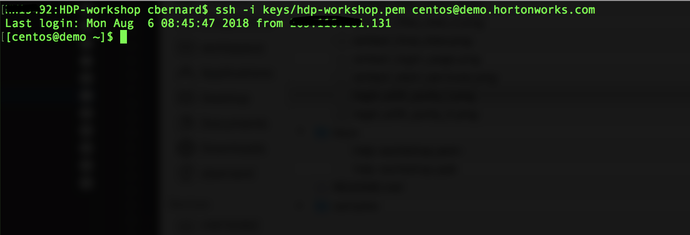
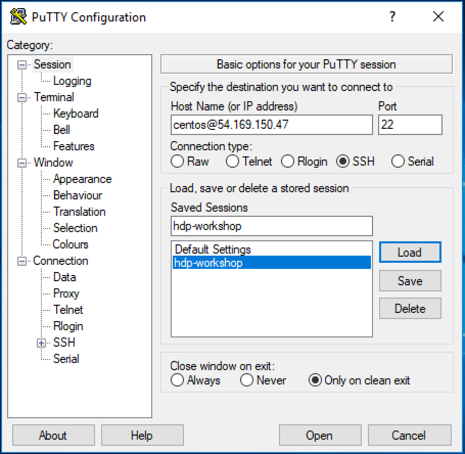
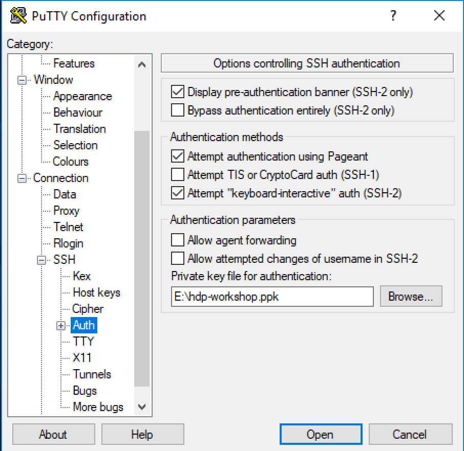

# HDP Labs

Content

* [Lab 1 - Accessing the sandbox](#accessing-the-sandbox)
* [Lab 2 - Load the sample datasets to HDFS](#load-the-sample-datasets-to-hdfs)
* [Lab 3 - Create Hive tables](#create-hive-tables)
* [Lab 4 - Analyze the datasets using SQL](#analyze-the-datasets-using-sql)

## Accessing the sandbox

Open a web browser and go to the following url

```http://<provided_url>:8080/```

Username: admin
Password: admin


Once logged in, start all services.

It can take up to 12 minutes...


# SSH to the sandbox

Add a new line to your **hosts** file such as

```11.11.11.11	demo.hortonworks.com```

Then download either the [ppk](keys/hdp-workshop.ppk) or [pem](keys/hdp-workshop.pem) private key whether you are using Windows or Mac

On Mac use the terminal to SSH

For Mac users, don't forget to ```chmod 400 /path/to/hdp-worshop.ppk``` before ssh'ing



On Windows use [putty](https://www.chiark.greenend.org.uk/~sgtatham/putty/latest.html)





## Load the sample datasets to HDFS

Download [GeoIPCountryCSV.zip](https://github.com/charlesb/HDP-workshop/raw/master/samples/GeoIPCountryCSV.zip) and [WebLogs.zip](https://github.com/charlesb/HDP-workshop/raw/master/samples/WebLogs.zip) from the samples folder

Follow this [link](https://dev.maxmind.com/geoip/legacy/csv/#GeoIP_Legacy_Country_CSV_Database_Fields) for a description of the GeoIP database.

Different formats can also be [downloaded](http://geolite.maxmind.com/download/geoip/database/GeoIPCountryCSV.zip)

Unzip the 2 files and go to Ambari's **Files View**


Then create these folders:

* /user/admin/workshop/ip_database
* /user/admin/workshop/raw_logs

And upload GeoIPCountryWhois.csv and access.log to ip_database and raw_logs respectively


**Exercise:** Explore the content on both files on HDFS

## Create Hive tables

Go to Ambaris's **Hive View 2.0**


First create a new database

```sql
CREATE DATABASE workshop;
```

And create the table below

```sql
CREATE EXTERNAL TABLE workshop.geo_ip_country_whois_csv (
start_ip_address STRING,
end_ip_address STRING,
start_ip_int BIGINT,
end_ip_int BIGINT,
country_code VARCHAR(2),
country_name VARCHAR(50)
)
ROW FORMAT SERDE 'org.apache.hadoop.hive.serde2.OpenCSVSerde'
WITH SERDEPROPERTIES (
   "separatorChar" = ",",
   "quoteChar"     = "\""
)
LOCATION '/user/admin/workshop/ip_database';
```

Create an optimized table

```sql
CREATE TABLE workshop.geo_ip_country_whois (
start_ip_address STRING,
end_ip_address STRING,
start_ip_int BIGINT,
end_ip_int BIGINT,
country_code VARCHAR(2),
country_name VARCHAR(50)
)
STORED AS ORC
TBLPROPERTIES ("orc.compress"="SNAPPY");
```

Import the CSV data

```sql
INSERT INTO workshop.geo_ip_country_whois SELECT * FROM workshop.geo_ip_country_whois_csv;
```

**Question:** What are the IP ranges for Singapore?

Create a table to access the semi-structured logs format

```sql
CREATE EXTERNAL TABLE workshop.raw_logs (
log STRING
)STORED AS TEXTFILE
LOCATION '/user/admin/workshop/raw_logs';
```

**Exercise:** Explore the table

Here is an example of Apache web server log:

```109.169.248.247 - - [12/Dec/2015:18:25:11 +0100] "GET /administrator/ HTTP/1.1" 200 4263 "-" "Mozilla/5.0 (Windows NT 6.0; rv:34.0) Gecko/20100101 Firefox/34.0" "-"```

Notice that web logs need to be parsed following a [specific pattern](https://httpd.apache.org/docs/1.3/logs.html#combined)

Here is an example of a regular expression to extract each field:

```(\S+) (\S+) (\S+) \[([^\]]+)\] "([A-Z]+) ([^ "]+)? HTTP\/[0-9.]+" ([0-9]{3}) ([0-9]+|-) "([^"]*)" "([^"]*)" "(\S+)"```

Click [here](https://regexr.com/3t58q) for regex description.

## Analyze the datasets using SQL

In order to increase the read performance we are going to extract the valuable information and insert the results in an optimized table


First we create a target table

```sql
CREATE TABLE workshop.web_logs (
ip VARCHAR(15),
ip_to_int BIGINT,
`time` STRING,
request STRING
)
STORED AS ORC
TBLPROPERTIES ("orc.compress"="SNAPPY");
```
We have added a new column ```ip_to_int``` to calculate the [integer representation of an IP (v4)](https://dev.maxmind.com/geoip/legacy/csv/#Integer_IPv4_Representation). It will be useful later to find out the origin of the connections.

The formula is:

```
first byte x 256^3 +
second byte x 256^2 +
third byte x 256^1 +
last byte
```

As an example, the integer representation of IP 10.0.5.9 is 167773449 (10×256^3 + 0×256^2 + 5×256^1 + 9)

Nowadays it's more commom to use [CIDR](https://en.wikipedia.org/wiki/Classless_Inter-Domain_Routing) for the IP range representation.

Then extract valuable pieces of information from raw data map them to previously created table definition.

```sql
INSERT OVERWRITE TABLE workshop.web_logs
SELECT
  regexp_extract(log, "([^ ]*) ([^ ]*) ([^ ]*) (-|\\[[^\\]]*\\]) ([^ \"]*|\"[^\"]*\") (-|[0-9]*) (-|[0-9]*)(?: ([^ \"]*|\"[^\"]*\") ([^ \"]*|\"[^\"]*\"))?", 1) ip,
  cast(regexp_extract(regexp_extract(log, "([^ ]*) ([^ ]*) ([^ ]*) (-|\\[[^\\]]*\\]) ([^ \"]*|\"[^\"]*\") (-|[0-9]*) (-|[0-9]*)(?: ([^ \"]*|\"[^\"]*\") ([^ \"]*|\"[^\"]*\"))?", 1),"(\\d+)\\.(\\d+)\\.(\\d+)\\.(\\d+)",1) as bigint) * 16777216 +
  cast(regexp_extract(regexp_extract(log, "([^ ]*) ([^ ]*) ([^ ]*) (-|\\[[^\\]]*\\]) ([^ \"]*|\"[^\"]*\") (-|[0-9]*) (-|[0-9]*)(?: ([^ \"]*|\"[^\"]*\") ([^ \"]*|\"[^\"]*\"))?", 1),"(\\d+)\\.(\\d+)\\.(\\d+)\\.(\\d+)",2) as bigint) * 65536 +
  cast(regexp_extract(regexp_extract(log, "([^ ]*) ([^ ]*) ([^ ]*) (-|\\[[^\\]]*\\]) ([^ \"]*|\"[^\"]*\") (-|[0-9]*) (-|[0-9]*)(?: ([^ \"]*|\"[^\"]*\") ([^ \"]*|\"[^\"]*\"))?", 1),"(\\d+)\\.(\\d+)\\.(\\d+)\\.(\\d+)",3) as bigint) * 256 +
  cast(regexp_extract(regexp_extract(log, "([^ ]*) ([^ ]*) ([^ ]*) (-|\\[[^\\]]*\\]) ([^ \"]*|\"[^\"]*\") (-|[0-9]*) (-|[0-9]*)(?: ([^ \"]*|\"[^\"]*\") ([^ \"]*|\"[^\"]*\"))?", 1),"(\\d+)\\.(\\d+)\\.(\\d+)\\.(\\d+)",4) as bigint) as ip_to_int,
  regexp_extract(log, "([^ ]*) ([^ ]*) ([^ ]*) (-|\\[[^\\]]*\\]) ([^ \"]*|\"[^\"]*\") (-|[0-9]*) (-|[0-9]*)(?: ([^ \"]*|\"[^\"]*\") ([^ \"]*|\"[^\"]*\"))?", 4) `time`,
  regexp_extract(log, "([^ ]*) ([^ ]*) ([^ ]*) (-|\\[[^\\]]*\\]) ([^ \"]*|\"[^\"]*\") (-|[0-9]*) (-|[0-9]*)(?: ([^ \"]*|\"[^\"]*\") ([^ \"]*|\"[^\"]*\"))?", 5) request
FROM workshop.raw_logs
```

**Questions:** How many logs do we have in the table?

We should have 10k logs!

**Exercise:** Retrieve the number of connections per origin

*tip:* Limit the number of logs to 100 as the cluster is a small sandbox

```sql
SELECT country_name, count(ip) as connections
FROM (
SELECT * FROM workshop.web_logs limit 100
) accesses
JOIN workshop.geo_ip_country_whois
ON ip_to_int between start_ip_int and end_ip_int
GROUP BY country_name
ORDER BY connections DESC;
```

**Exercise:** Explain the query using Ambari UI

## TODO

Create a Hive UDF to use CIDR notation instead

https://github.com/maxmind/geoip2-csv-converter

## NiFi and Hive Streaming

```bash
su - admin
cd nifi-1.5.0.3.1.2.0-7
./bin/nifi.sh start
```

Then visit http://demo.hortonworks.com:8079/nifi


